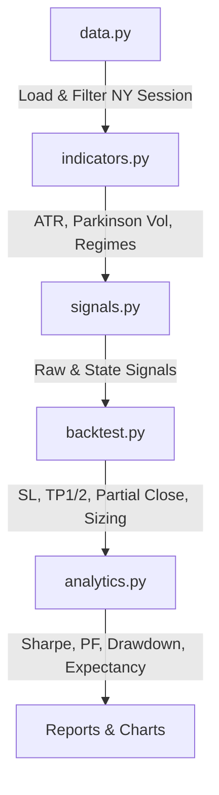

# Volatility Persistence Trading Framework


---

## What is this?

A modular, pure-Python backtesting framework for developing and validating quantitative cryptocurrency trading strategies. Built from scratch with a focus on realistic execution modelling — every trade accounts for variable slippage based on volatility regime, exchange fees, concurrent position management, and partial take-profit mechanics.

The framework was used to run an exhaustive combinatorial backtest across **48 strategy variants** (2 assets × 2 signals × 3 exit modes × 2 session filters × 2 sizing methods), then validated each profitable variant through **rolling walk-forward analysis** on unseen out-of-sample periods. The top strategy — ETH Raw ATR5 RR with NY session filter and compounding — produced **+383.5% ROI, Sharpe 1.79, and Max Drawdown 26.4%** over 3.5 years of 1-hour data, with **6 out of 7 independent OOS windows profitable**.

---

## Features

- **Multi-candle backtest engine** — concurrent position slots (up to N open trades), realistic intra-bar SL/TP evaluation, entry delay testing for look-ahead bias checks
- **Partial take-profit system** — close 50% at TP1, move SL to breakeven, let remainder run to TP2
- **Variable slippage model** — slippage scales with volatility regime (low / medium / high / extreme), not a fixed flat rate
- **4H EMA trend filter** — higher-timeframe direction filter suppresses counter-trend entries
- **NY session filter** — restricts entries to New York session (09:00–17:00 ET) for higher-quality setups
- **Rolling walk-forward validation** — 4-month OOS windows rolled forward to test robustness on unseen data
- **Combinatorial ranking engine** — composite robustness score (Sharpe + PF + DD + Expectancy + Trades + R/DD)
- **Cost sensitivity stress test** — re-runs top strategies at 1×, 2×, 3× transaction costs
- **Regime diagnostics** — MFE/MAE excursion analysis, TP1 hit rate breakdown, false breakout detection per walk-forward window

---

## 🚀 Quick Start

### 1. Clone & Install

```bash
git clone https://github.com/anaysharma1717-svg/volatility-persistence-trading-framework.git
cd volatility-persistence-trading-framework
pip install -r requirements.txt
```

### 2. Data Setup

Place your 1-hour OHLCV CSV files into a directory and point the framework to it:

```bash
# Linux / macOS
export DATA_BASE_DIR="/path/to/your/1hour/ohlcv"

# Windows (PowerShell)
$env:DATA_BASE_DIR = "C:\path\to\your\1hour\ohlcv"
```

Supported formats: standard headered CSV, or headerless Binance-export format (timestamp, open, high, low, close, ...).

### 3. Run the Full Combinatorial Backtest

Tests all 48 strategy variants, ranks by composite score, outputs a Markdown report + chart:

```bash
python scripts/run_full_backtest.py
```

Output → `reports/full_backtest/`

### 4. Run Walk-Forward Validation

Rolling out-of-sample validation with 4-month windows:

```bash
python scripts/run_walk_forward_v2.py
```

Output → `reports/walk_forward_v2/`

### 5. Generate Comprehensive Report with Charts

Runs the top 6 strategies and produces 7 charts (equity curves, drawdowns, monthly heatmap, PnL distribution, walk-forward ROI, Sharpe, strategy comparison):

```bash
python scripts/generate_backtest_report.py
```

Output → `reports/backtest_report/`

---

## ⚙️ Architecture

The platform is organized into clean, decoupled modules:



| Module | Responsibility |
|---|---|
| `config.py` | All parameters — risk, sizing, exit modes, filters, slippage |
| `data.py` | Data loading, NY session filter, datetime parsing, 4H EMA trend filter |
| `indicators.py` | ATR (14-period & 5-period), Parkinson volatility, regime thresholds |
| `signals.py` | Raw directional candle signals and trend-state transition signals |
| `backtest.py` | Core simulator — concurrent trades, SL/TP evaluation, partial TP, position sizing |
| `analytics.py` | Sharpe (daily time-series), Profit Factor, Drawdown curves, MFE/MAE, Expectancy |

---

## 🔬 Research Process

This project was developed through multiple iterations rather than a single successful backtest. Early experiments focused on simple momentum and breakout rules using 1-minute and 3-minute data. While these initial strategies produced exceptionally high gross returns, introducing realistic transaction costs caused most of the apparent edge to disappear — at 3-minute granularity, fees alone consumed 95–100% of returns across all tested variants. This forced a shift to higher timeframes where transaction cost impact is smaller relative to trade expectancy.

On 1-hour candles, multiple combinations of stop-loss distances, reward-to-risk ratios, position sizing methods, volatility filters, and session filters were evaluated across BTC and ETH. Rather than selecting parameters solely based on return, emphasis was placed on consistency, drawdown control, and robustness across different market conditions.

To reduce overfitting risk, the final strategy was validated using rolling walk-forward analysis, fixed versus compounding capital comparisons, cross-asset testing (BTC vs ETH), and detailed regime analysis. Strategies that appeared highly profitable during standard backtesting but failed out-of-sample were rejected. Only those demonstrating stable performance across multiple unseen periods were retained.

The final research stage focused on understanding *why* the strategy fails in certain windows. Trade-level analysis using MFE, MAE, trend persistence, and false breakout statistics showed that losing periods were not caused by weaker trends or lower volatility — the decisive factor was a drop in TP1 hit rate, which prevented the breakeven SL move from triggering, leading to a cascade of full stop-loss exits.

---

## 📊 Results

### Top Strategy — ETH Raw ATR5 RR · NY Session ON · Compounding

| Metric | Value |
|---|---|
| ROI (full history) | +383.5% |
| Sharpe Ratio | 1.79 |
| Profit Factor | 1.63 |
| Max Drawdown | 26.4% |
| Return / Drawdown Ratio | 14.52 |
| Total Trades | 849 |
| Win Rate | 43.9% |
| Expectancy per Trade | $4,517 |
| Avg Winner / Avg Loser | $26,475 / -$12,690 |

### Walk-Forward Out-of-Sample Summary

Rolling 4-month OOS windows — each window's parameters are fixed from the prior period, and performance is measured on completely unseen data:

| Window | OOS Period | ROI% | Sharpe | Result |
|---|---|---|---|---|
| W1 | Nov 2023 – Mar 2024 | +64.2% | 3.90 | ✅ Profitable |
| W2 | Mar 2024 – Jul 2024 | -14.2% | -1.92 | ❌ Loss |
| W3 | Jul 2024 – Nov 2024 | +11.0% | 1.06 | ✅ Profitable |
| W4 | Nov 2024 – Mar 2025 | +18.2% | 1.65 | ✅ Profitable |
| W5 | Mar 2025 – Jul 2025 | +3.7% | 0.65 | ✅ Profitable |
| W6 | Jul 2025 – Nov 2025 | +49.5% | 3.30 | ✅ Profitable |
| W7 | Nov 2025 – Mar 2026 | +66.2% | 4.44 | ✅ Profitable |

**6 / 7 windows profitable · Average OOS ROI: +28.4% · Average OOS Sharpe: 2.15**

The one losing window (W2) coincides with ETH's Mar–Jul 2024 consolidation phase. Regime analysis confirmed the loss was caused by a drop in TP1 hit rate (36% vs 48% in winning windows), not by weaker trend conditions.

---

## 🔍 Market Regime Diagnostics

Excursion and trend persistence analysis comparing profitable vs. losing walk-forward windows:

| Metric | Winning Windows | Losing Windows | Difference |
|:---|:---:|:---:|:---:|
| **Average ADX (Trend Strength)** | 27.82 | 28.13 | -0.31 |
| **Average ATR (Volatility)** | 37.21 | 38.32 | -1.11 |
| **Average EMA 50 Slope** | +0.16 | **-0.32** | +0.48 |
| **Trade Win Rate** | 47.79% | 36.03% | +11.76% |
| **Profit Factor** | 1.43 | 0.74 | +0.69 |
| **Max Consecutive Losses** | 9.3 | 14.0 | -4.7 |
| **TP1 Hit Rate** | 47.79% | **36.03%** | +11.76% |
| **Stop Loss Hit Rate** | 77.12% | 87.36% | -10.24% |
| **Median MFE** | 1.48 ATR | 0.91 ATR | +0.57 ATR |
| **Median MAE** | 1.02 ATR | 1.11 ATR | -0.09 ATR |

**Key finding:** ADX and ATR are almost identical between winning and losing windows — the strategy does not fail due to weak trends or low volatility. It fails when the EMA 50 slope turns negative (choppy, corrective market) causing trades to reverse before reaching TP1. When TP1 is missed, the breakeven SL move never triggers and the original stop is hit 87% of the time.

---

## 📄 License

This project is licensed under the MIT License — see the [LICENSE](LICENSE) file for details.
