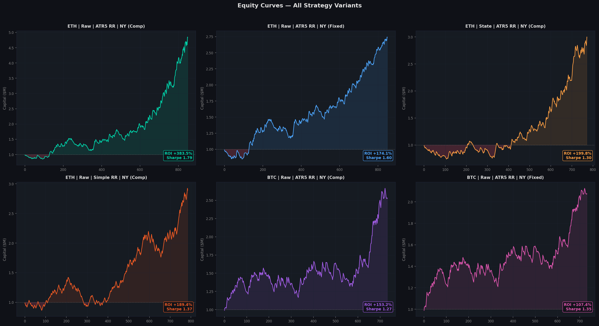
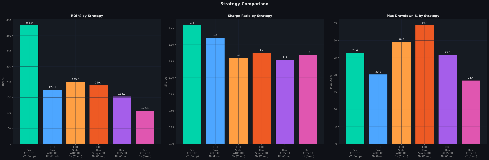
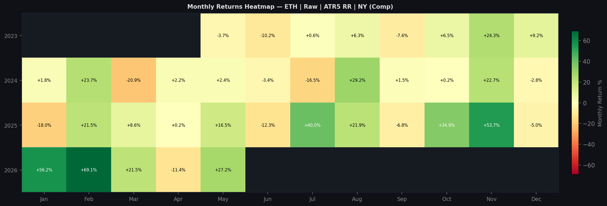
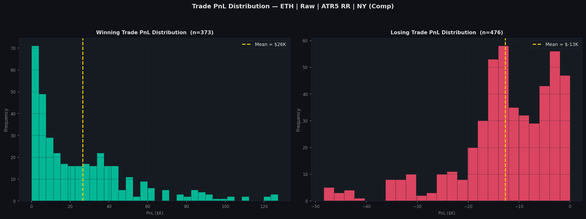
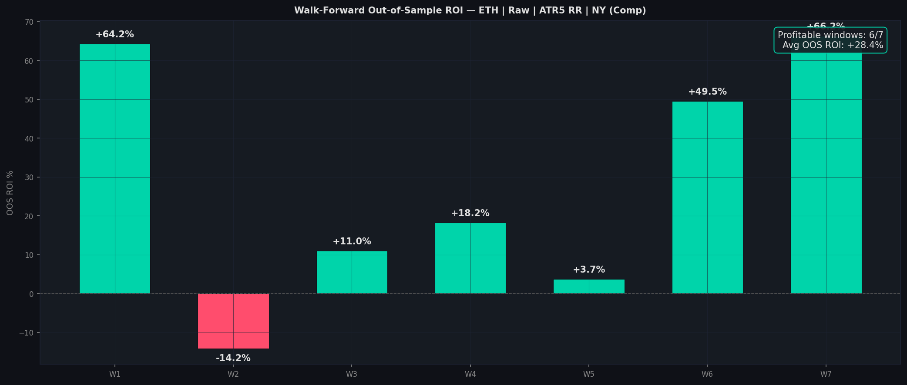
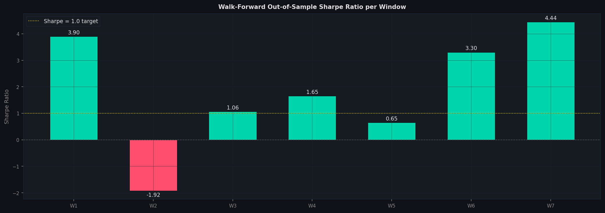
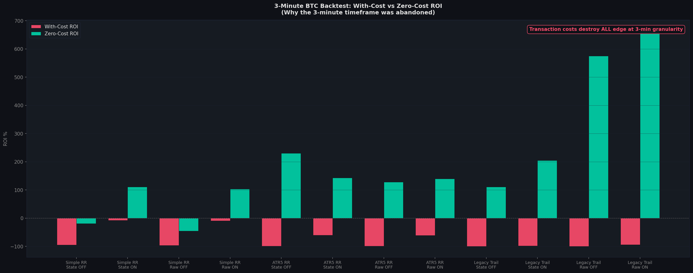
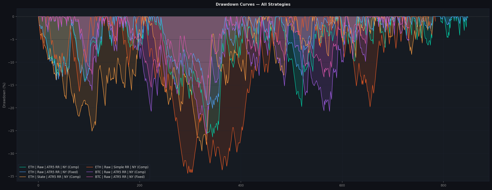

# Backtest Results Report

This report presents backtest performance results for the volatility persistence trading strategy across historical cryptocurrency data.

- Universe: BTCUSDT, ETHUSDT (1-hour candles)
- Period: January 2023 to May 2026
- Starting Capital: $1,000,000

---

### System Configuration

The simulator utilizes the following default configuration parameters:

- Risk per Trade: 1% of equity
- SL Distance: 1.5x ATR (14-period)
- Partial TP1: 2.0x risk (closes 50% position, moves SL to entry)
- Full TP2: 3.0x risk
- Session Filter: New York session (09:00 to 17:00 ET)
- Volatility Filter: Active (high-volatility regimes only)
- Trend Filter: Active (4-hour 200-period EMA direction)
- Max Concurrent Positions: 3
- Transaction Fees: 0.02% per side
- Slippage: Dynamic (0.5 to 5.0 bps based on volatility regime)

---

### Equity Curves

The chart below shows equity growth curves for the main strategy variants:

---

### Performance Summary

The table below summarizes performance metrics across the top configurations:

| Strategy | Trades | Win Rate | ROI | Sharpe | Max Drawdown | Profit Factor | Expectancy | Average Win | Average Loss | Return/Drawdown |
|---|---|---|---|---|---|---|---|---|---|---|
| ETH Raw ATR5 RR NY (Comp) | 849 | 43.9% | +383.5% | 1.79 | 26.4% | 1.63 | $4.5K | $26.5K | -$12.7K | 14.52 |
| ETH Raw ATR5 RR NY (Fixed) | 849 | 43.9% | +174.1% | 1.60 | 20.1% | 1.52 | $2.1K | $13.7K | -$7.1K | 8.65 |
| ETH State ATR5 RR NY (Comp) | 772 | 42.1% | +199.8% | 1.30 | 29.5% | 1.49 | $2.6K | $18.8K | -$9.2K | 6.78 |
| ETH Raw Simple RR NY (Comp) | 785 | 49.2% | +189.4% | 1.37 | 34.4% | 1.39 | $2.4K | $17.5K | -$12.2K | 5.51 |
| BTC Raw ATR5 RR NY (Comp) | 733 | 42.4% | +153.2% | 1.27 | 25.8% | 1.32 | $2.1K | $20.4K | -$11.4K | 5.94 |
| BTC Raw ATR5 RR NY (Fixed) | 733 | 42.4% | +107.4% | 1.35 | 18.4% | 1.34 | $1.5K | $13.7K | -$7.5K | 5.84 |

The chart below contrasts ROI, Sharpe, and Maximum Drawdown metrics across strategies:

---

### Top Strategy Highlight

The raw breakout signal on Ethereum with a 5-period ATR trailing exit, New York session filter active, and compounding position sizing (ETH Raw ATR5 RR NY Comp) was the top-performing configuration.

Top Strategy Metrics
- Return on Investment: +383.5%
- Sharpe Ratio: 1.792
- Profit Factor: 1.63
- Maximum Drawdown: 26.4%
- Return to Drawdown Ratio: 14.52
- Expectancy per Trade: $4,517
- Total Trades: 849
- Win Rate: 43.9%
- Average Winner: $26,475
- Average Loser: -$12,690
- Exit Reasons (SL / TP): 725 / 124

The monthly distribution of returns for this configuration is shown below:

The distribution of trade outcomes for winning and losing executions is displayed below:

---

### Performance Across 4-Month Windows

Performance breakdown across consecutive 4-month historical segments:

| Window | Period | ROI | Sharpe | Status |
|---|---|---|---|---|
| W1 | Nov 2023 - Mar 2024 | +64.2% | 3.90 | Profitable |
| W2 | Mar 2024 - Jul 2024 | -14.2% | -1.92 | Unprofitable |
| W3 | Jul 2024 - Nov 2024 | +11.0% | 1.06 | Profitable |
| W4 | Nov 2024 - Mar 2025 | +18.2% | 1.65 | Profitable |
| W5 | Mar 2025 - Jul 2025 | +3.7% | 0.65 | Profitable |
| W6 | Jul 2025 - Nov 2025 | +49.5% | 3.30 | Profitable |
| W7 | Nov 2025 - Mar 2026 | +66.2% | 4.44 | Profitable |

The average return across windows was +28.4% with an average Sharpe ratio of 2.15.

The charts below display ROI and Sharpe ratios per window:

---

### 3-Minute Timeframe Comparison

Early research evaluated strategy rules on 3-minute candles. Although gross returns were positive, introducing transaction costs (fees and slippage) degraded performance significantly.

The table below details ROI with and without transaction costs:

| SL Strategy | Signal | NY | With-Cost ROI | Zero-Cost ROI | Cost Impact |
|---|---|---|---|---|---|
| Simple RR 3:1 | State | OFF | -95.3% | -19.1% | Unprofitable without costs |
| Simple RR 3:1 | State | ON | -7.6% | +111.0% | Costs eliminated profit |
| Simple RR 3:1 | Raw | OFF | -96.7% | -45.1% | Unprofitable without costs |
| Simple RR 3:1 | Raw | ON | -9.3% | +103.7% | Costs eliminated profit |
| ATR5 RR | State | OFF | -98.8% | +230.4% | Costs eliminated profit |
| ATR5 RR | State | ON | -60.7% | +142.9% | Costs eliminated profit |
| ATR5 RR | Raw | OFF | -99.2% | +128.0% | Costs eliminated profit |
| ATR5 RR | Raw | ON | -60.9% | +139.4% | Costs eliminated profit |
| Legacy Trail | State | OFF | -100.0% | +110.7% | Costs eliminated profit |
| Legacy Trail | State | ON | -98.2% | +204.6% | Costs eliminated profit |
| Legacy Trail | Raw | OFF | -100.0% | +575.3% | Costs eliminated profit |
| Legacy Trail | Raw | ON | -94.0% | +664.3% | Costs eliminated profit |

The chart below contrasts with-cost and zero-cost performance on the 3-minute timeframe:

---

### Market Regime Analysis

Comparison of trade metrics during winning windows versus losing windows:

| Metric | Winning Windows | Losing Windows | Difference |
|---|---|---|---|
| Average ADX | 27.82 | 28.13 | -0.31 |
| Average ATR | 37.21 | 38.32 | -1.11 |
| Average EMA 50 Slope | +0.16 | -0.32 | +0.48 |
| Trade Win Rate | 47.79% | 36.03% | +11.76% |
| Profit Factor | 1.43 | 0.74 | +0.69 |
| Maximum Consecutive Losses | 9.3 | 14.0 | -4.7 |
| TP1 Hit Rate | 47.79% | 36.03% | +11.76% |
| Stop Loss Hit Rate | 77.12% | 87.36% | -10.24% |
| Median MFE | 1.48 ATR | 0.91 ATR | +0.57 ATR |
| Median MAE | 1.02 ATR | 1.11 ATR | -0.09 ATR |

---

### Cost Sensitivity Stress Test

The table below shows performance metrics for the top strategies when transaction costs are multiplied by three:

| Rank | Strategy | Base ROI | ROI at 3x Cost | Status | Cost Sensitivity |
|---|---|---|---|---|---|
| 1 | ETH Raw ATR5 RR NY (Comp) | +383.5% | +164.0% | Profitable | 0.573 |
| 2 | ETH Raw ATR5 RR NY (Fixed) | +174.1% | +113.0% | Profitable | 0.350 |
| 3 | ETH State ATR5 RR NY (Comp) | +199.8% | +69.0% | Profitable | 0.654 |
| 4 | ETH State Simple RR NY (Comp) | +185.0% | +103.0% | Profitable | 0.442 |
| 5 | ETH Raw Simple RR NY (Comp) | +189.4% | +102.0% | Profitable | 0.462 |

---

### Drawdown Curves

Drawdown trajectories for the evaluated strategy variants:

