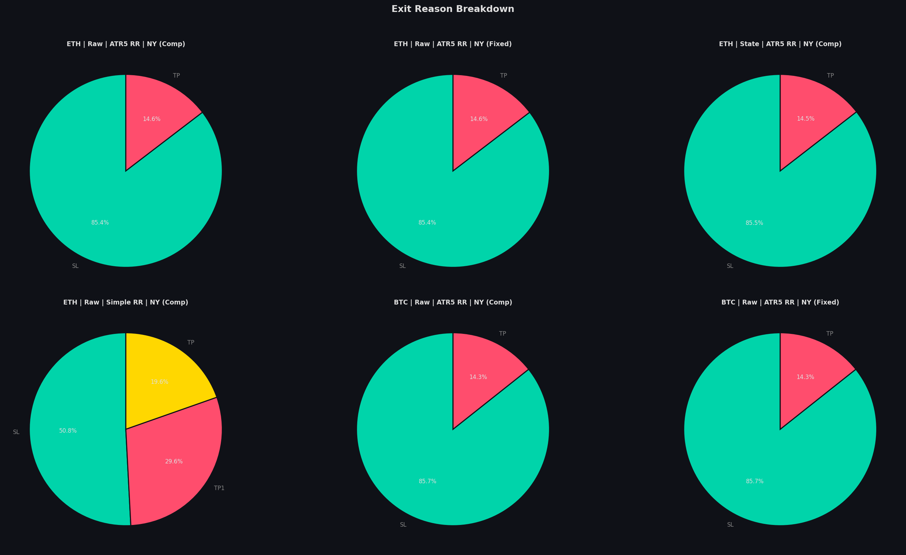

# Backtest Results Report

**Generated:** 2026-06-27 01:33:58  
**Universe:** BTCUSDT, ETHUSDT — 1-hour candles  
**Period:** Full available history  
**Starting Capital:** $1,000,000  

---

## Configuration

| Parameter | Value |
|---|---|
| Risk per Trade | 1% of equity |
| SL Distance | 1.5× ATR(14) |
| Partial TP1 | 2.0× risk → close 50%, move SL to breakeven |
| Full TP2 | 3.0× risk |
| Session Filter | New York (09:00–17:00 ET) |
| Volatility Filter | High-vol regime only |
| Trend Filter | 4H EMA-200 direction |
| Max Concurrent | 3 open positions |
| Fees | 0.02% per side |
| Slippage | 0.5–5.0 bps (regime-dependent) |

---

## Strategy Performance Summary

| Strategy | Trades | Win% | ROI% | Sharpe | Max DD% | PF | Expectancy | Avg Win | Avg Loss | R/DD |
| --- | --- | --- | --- | --- | --- | --- | --- | --- | --- | --- |
| ETH | Raw | ATR5 RR | NY (Comp) | 849 | 43.9% | +383.5% | 1.79 | 26.4% | 1.63 | $4.5K | $26.5K | $-12.7K | 14.52 |
| ETH | Raw | ATR5 RR | NY (Fixed) | 849 | 43.9% | +174.1% | 1.60 | 20.1% | 1.52 | $2.1K | $13.7K | $-7.1K | 8.65 |
| ETH | State | ATR5 RR | NY (Comp) | 772 | 42.1% | +199.8% | 1.30 | 29.5% | 1.49 | $2.6K | $18.8K | $-9.2K | 6.78 |
| ETH | Raw | Simple RR | NY (Comp) | 785 | 49.2% | +189.4% | 1.37 | 34.4% | 1.39 | $2.4K | $17.5K | $-12.2K | 5.51 |
| BTC | Raw | ATR5 RR | NY (Comp) | 733 | 42.4% | +153.2% | 1.27 | 25.8% | 1.32 | $2.1K | $20.4K | $-11.4K | 5.94 |
| BTC | Raw | ATR5 RR | NY (Fixed) | 733 | 42.4% | +107.4% | 1.35 | 18.4% | 1.34 | $1.5K | $13.7K | $-7.5K | 5.84 |

---

## Top Strategy Highlight

> **ETH | Raw | ATR5 RR | NY (Comp)** — Composite Score: #1 out of 48 variants

| Metric | Value |
|---|---|
| ROI | +383.5% |
| Sharpe Ratio | 1.792 |
| Profit Factor | 1.63 |
| Max Drawdown | 26.4% |
| Return/DD Ratio | 14.52 |
| Expectancy per Trade | $4,517 |
| Total Trades | 849 |
| Win Rate | 43.9% |
| Avg Winner | $26,475 |
| Avg Loser | $-12,690 |

---

## Walk-Forward Out-of-Sample Results

> Strategy: **ETH | Raw | ATR5 RR | NY (Comp)** | 4-month OOS windows

| Window | OOS Start | OOS End | OOS ROI% | OOS Sharpe | Result |
| --- | --- | --- | --- | --- | --- |
| W1 | 2023-11-01 | 2024-03-01 | +64.2% | 3.90 | ✅ Profitable |
| W2 | 2024-03-01 | 2024-07-01 | -14.2% | -1.92 | ❌ Loss |
| W3 | 2024-07-01 | 2024-11-01 | +11.0% | 1.06 | ✅ Profitable |
| W4 | 2024-11-01 | 2025-03-01 | +18.2% | 1.65 | ✅ Profitable |
| W5 | 2025-03-01 | 2025-07-01 | +3.7% | 0.65 | ✅ Profitable |
| W6 | 2025-07-01 | 2025-11-01 | +49.5% | 3.30 | ✅ Profitable |
| W7 | 2025-11-01 | 2026-03-01 | +66.2% | 4.44 | ✅ Profitable |

**Profitable windows:** 6 / 7  
**Average OOS ROI:** +28.4%  
**Average OOS Sharpe:** 1.87  

---

## Charts

### Equity Curves

### Drawdown Curves

### Monthly Returns Heatmap

### Trade PnL Distribution

### Walk-Forward OOS ROI

### Walk-Forward Sharpe

### Strategy Comparison

### Exit Reason Breakdown

